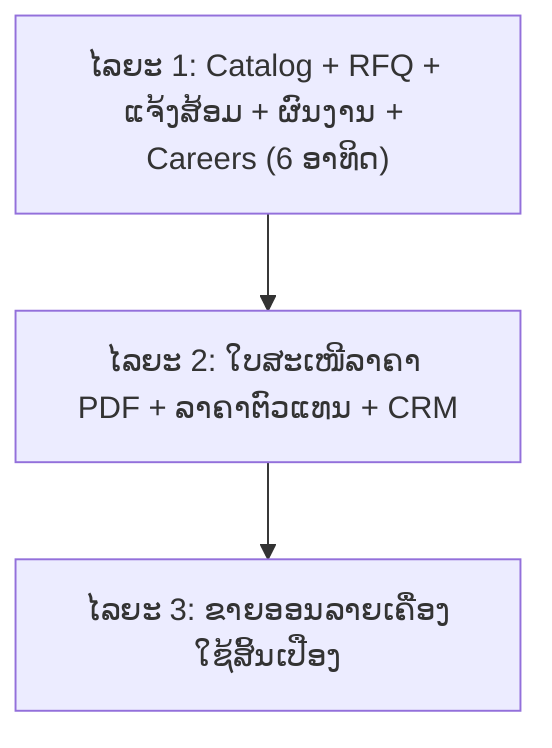

# ແຜນງານການພັດທະນາລະບົບເວັບໄຊທ໌ໃໝ່: ບໍລິສັດ ຊັບທະວີຄູນ ຈຳກັດຜູ້ດຽວ (XUPTHAVYKHOUN SOLE CO., LTD)
**ໂຄງການ:** ເວັບໄຊທ໌ Catalog + ຂໍໃບສະເໜີລາຄາ (RFQ) ສຳລັບອຸປະກອນການແພດ ແລະ ບໍລິການເຕັກນິກ  
**ທີ່ຕັ້ງໂຟເດີ:** `/Users/ta/xtvk`  
**ວັນທີຈັດທຳ:** 2026-10-04 (ປັບປຸງຫຼັງກວດສອບເວັບເກົ່າ ແລະ ເພສຕົວຈິງ)  
**ເວັບໄຊທ໌ເປົ້າໝາຍ:** `www.xtklaos.com`  
**ແຫຼ່ງອ້າງອີງ:** ບລັອກອັງກິດ, ບລັອກລາວ, ເພສ `https://www.facebook.com/xtkadmin` (ເບິ່ງ [README.md](./README.md))

---

## 1. ເປົ້າໝາຍຂອງໂຄງການ
1. **ປ່ຽນ `xtklaos.com` ຈາກໜ້າເລືອກພາສາ ໃຫ້ເປັນເວັບໄຊທ໌ຕົວຈິງ** ແທນ 2 ບລັອກ Blogspot.
2. **Catalog ສິນຄ້າທີ່ມີໜ້າຂອງແຕ່ລະສິນຄ້າ:** ລຸ້ນ, ຍີ່ຫໍ້, ສະເປັກ, ຂະໜາດບັນຈຸ, ສະຖານະ "ພ້ອມສົ່ງ".
3. **ຂໍໃບສະເໜີລາຄາ (RFQ) ເປັນຊ່ອງທາງຂາຍຫຼັກ** ສຳລັບໂຮງໝໍ, ຄລີນິກ, ຕົວແທນ ແລະ ໂຄງການລັດ.
4. **ບໍລິການເຕັກນິກ:** ຟອມແຈ້ງສ້ອມ ແລະ ຕິດຕາມສະຖານະ.
5. **ສະແດງຜົນງານ:** ການຕິດຕັ້ງ, ສົ່ງມອບ ແລະ ສອນການນຳໃຊ້ ທີ່ປັດຈຸບັນມີແຕ່ໃນ Facebook.
6. **2 ພາສາ (ລາວ / ອັງກິດ)** ແລະ ໃຊ້ງານໃນມືຖືໄດ້ດີ.
7. **ຂາຍອອນລາຍ (ໄລຍະ 3):** ສະເພາະເຄື່ອງໃຊ້ສິ້ນເປືອງ, ເມື່ອມີລາຄາ ແລະ ສັນຍາຮັບຊຳລະແລ້ວ.

---

## 2. ຜົນການກວດສອບລະບົບປັດຈຸບັນ (2026-10-04)

### 2.1 ໂດເມນ `xtklaos.com`
* ເປີດໃຊ້ຢູ່ແລ້ວ: ໜ້າ HTML ໜ້າດຽວ (12 KB, Apache, EasyWinHOST, ແກ້ໄຂຫຼ້າສຸດ 21/05/2024) ໃຫ້ເລືອກພາສາແລ້ວສົ່ງຕໍ່ໄປບລັອກ.
* MX ຂອງໂດເມນຊີ້ໃສ່ເຊີເວີດຽວກັນ: **ອີເມວ @xtklaos.com ຂຶ້ນກັບ hosting ນີ້**.
* ບໍ່ມີ `robots.txt` ແລະ `sitemap.xml`.

### 2.2 ບລັອກ Blogspot (2 ບລັອກ)
* ສະບັບອັງກິດ 11 ໂພສ, ສະບັບລາວ 10 ໂພສ. ແຕ່ລະໝວດສິນຄ້າເປັນໂພສດຽວ: ມີຮູບ ແລະ ລາຍຊື່ປະເພດສິນຄ້າ, **ບໍ່ມີໜ້າສິນຄ້າແຍກ, ລາຄາ, SKU, ຍີ່ຫໍ້ ຫຼື ສະເປັກ**.
* ຮູບ 35 ຮູບທີ່ຝາກໄວ້ OneDrive ຕອບ 503 ທັງໝົດ (ສະໄລໜ້າຫຼັກ, ໜ້າຕິດຕໍ່, ໂພສ Health Care ເກົ່າ). ຮູບ 54 ຮູບໃນ Blogger ຍັງໂຫຼດໄດ້.
* ລິ້ງ WhatsApp ທຸກປຸ່ມໃຊ້ເບີ `85602055892929` (ມີ 0 ເກີນ). ທີ່ຖືກແມ່ນ `8562055892929`.
* ລິ້ງ Facebook ຊີ້ໄປ `facebook.com/logodesign2017` ບໍ່ແມ່ນ `xtkadmin`.
* ໜ້າ "Get a quote" ຫວ່າງເປົ່າ. ໜ້າ Career ມີຟອມ JotForm ທີ່ແນບເອກະສານໄດ້.
* SEO: meta description ຫວ່າງ, ຮູບບໍ່ມີ alt, ບໍ່ມີ structured data.

### 2.3 ເພສ Facebook `xtkadmin`
* 1,610 ຜູ້ຕິດຕາມ, ໝວດ Medical & health, ໂພສປະມານ 1 ຄັ້ງຕໍ່ອາທິດ (ກວດ 20 ໂພສ ລະຫວ່າງ 05/2026 ຫາ 09/2026).
* ມີ **ລຸ້ນ ແລະ ຍີ່ຫໍ້ຕົວຈິງ** (XTKBio+, Xupwell, Genrui, Chison, LumiQuick), ສະເປັກ ແລະ ຂະໜາດບັນຈຸ. ລາຍລະອຽດຢູ່ [PRODUCT_STRUCTURE_AND_CATALOG.md](./PRODUCT_STRUCTURE_AND_CATALOG.md).
* ປະເພດໂພສ: ໂປຣໂມດສິນຄ້າ, ກວດເຊັກກ່ອນສົ່ງ, ຕິດຕັ້ງ ແລະ ສອນໃຊ້ທີ່ລູກຄ້າ, ຜູ້ສະໜອງມາຢ້ຽມຢາມ, ຮັບສະໝັກງານ, ກິດຈະກຳບໍລິສັດ.
* ຈຸດຂາຍທີ່ໃຊ້ຊ້ຳ: "ມີພ້ອມສົ່ງ", ມາດຕະຖານ CE / FDA / ISO 13485, "ເຈົ້າຂອງທຸລະກິດແມ່ນນັກເພຊັດສະກອນ", "ຖາມໄດ້ໃນລາຄາຕົວແທນ".
* **ບໍ່ມີໂພສໃດບອກລາຄາ**; ລູກຄ້າຖາມລາຄາໃນຄອມເມັນ. ຊ່ອງທາງຕອບແມ່ນ Messenger ແລະ ໂທລະສັບ.

---

## 3. ປຽບທຽບ ລະບົບປັດຈຸບັນ vs ລະບົບໃໝ່

| ຫົວຂໍ້ | ປັດຈຸບັນ | ລະບົບໃໝ່ |
| :--- | :--- | :--- |
| **Platform** | ໜ້າເລືອກພາສາ + 2 ບລັອກ Blogger | ເວັບດຽວ 2 ພາສາ (Next.js) ເທິງ `xtklaos.com` |
| **ສິນຄ້າ** | 1 ໂພສຕໍ່ໝວດ, ມີແຕ່ຊື່ປະເພດ | ໜ້າສິນຄ້າແຍກ: ລຸ້ນ, ຍີ່ຫໍ້, ສະເປັກ, ຂະໜາດບັນຈຸ, ສະຖານະສະຕັອກ |
| **ຂໍ້ມູນສິນຄ້າໃໝ່** | ຢູ່ໃນ Facebook ເທົ່ານັ້ນ | ຢູ່ໃນເວັບ, ແລ້ວແຊຣ໌ລິ້ງໄປ Facebook |
| **ຮູບພາບ** | OneDrive ເສຍ 35 ຮູບ | Cloud Storage + CDN |
| **ຂໍລາຄາ** | ປຸ່ມ WhatsApp (ເບີຜິດຮູບແບບ), ໜ້າ quote ຫວ່າງ | ກະຕ່າ RFQ ຫຼາຍລາຍການ + ແຈ້ງເຕືອນທີມຂາຍ + ປຸ່ມ WhatsApp/Messenger ທີ່ໃສ່ຊື່ສິນຄ້າໃຫ້ |
| **ລາຄາຕົວແທນ** | ບອກທາງແຊັດ | ລະດັບລາຄາຕາມປະເພດລູກຄ້າ (ໄລຍະ 2) |
| **ຜົນງານ / ຂ່າວ** | ຢູ່ໃນ Facebook ເທົ່ານັ້ນ | ໜ້າຜົນງານ ແລະ ຂ່າວ |
| **ບໍລິການເຕັກນິກ** | ຂໍ້ຄວາມ + Hotline | ຟອມແຈ້ງສ້ອມ + ເລກຕິດຕາມ |
| **ຮັບສະໝັກງານ** | ໂພສ Facebook + ຟອມ JotForm ໃນບລັອກ | ໜ້າ Careers ພ້ອມຟອມອັບໂຫຼດ CV |
| **ຊຳລະເງິນ** | ບໍ່ມີ | ໄລຍະ 3 ສະເພາະເຄື່ອງໃຊ້ສິ້ນເປືອງ |
| **SEO** | ບໍ່ມີ description, alt, sitemap | Metadata, structured data, sitemap, hreflang |

---

## 4. ຟັງຊັນຂອງລະບົບ

### 4.1 ໜ້າເວັບ (ໄລຍະ 1)
1. **ໜ້າຫຼັກ:** ທາງລັດ 6 ໝວດ, ສິນຄ້າພ້ອມສົ່ງ, ຍີ່ຫໍ້, ຜົນງານຫຼ້າສຸດ, ຈຸດເດັ່ນ (ປະສົບການ, ບໍລິການຫຼັງການຂາຍ, ເຈົ້າຂອງເປັນເພຊັດສະກອນ).
2. **Catalog:** ໝວດ ແລະ ໝວດຍ່ອຍ, ຄົ້ນຫາຕາມຊື່ / ລຸ້ນ / ຍີ່ຫໍ້, ກອງຕາມຍີ່ຫໍ້ ແລະ ສະຖານະ (ພ້ອມສົ່ງ / ສັ່ງຈອງ).
3. **ໜ້າສິນຄ້າ:**
   * ຮູບ, ຕາຕະລາງສະເປັກ, ມາດຕະຖານ (CE, FDA, ISO), ເລກທະບຽນ ອຢ (ຖ້າມີ), Brochure PDF.
   * ຕົວເລືອກ (variant) ແລະ ຂະໜາດບັນຈຸ ເຊັ່ນ 25 test/ກ່ອງ, 100/ແພັກ.
   * **ສິນຄ້າທີ່ໃຊ້ຮ່ວມກັນ:** ເຄື່ອງວິເຄາະ ↔ ນ້ຳຢາ ↔ ເຈ້ຍພິມ.
   * ປຸ່ມ "ເພີ່ມເຂົ້າໃບຂໍລາຄາ", "ຖາມຜ່ານ WhatsApp", "ຖາມຜ່ານ Messenger".
4. **ໜ້າຍີ່ຫໍ້:** ແຍກຍີ່ຫໍ້ຂອງບໍລິສັດເອງ (XTKBio+, Xupwell) ຈາກຍີ່ຫໍ້ທີ່ຈຳໜ່າຍ.
5. **ກະຕ່າ RFQ:** ເລືອກຫຼາຍລາຍການ, ກອກຊື່ອົງກອນ, ປະເພດລູກຄ້າ (ໂຮງໝໍ / ຄລີນິກ / ຕົວແທນ / ລັດ / ບຸກຄົນ), ຜູ້ຕິດຕໍ່, ເບີໂທ. ລະບົບອອກເລກອ້າງອີງ ແລະ ແຈ້ງທີມຂາຍ.
6. **ບໍລິການເຕັກນິກ:** ຟອມແຈ້ງສ້ອມ (ລຸ້ນ, Serial No, ອາການ, ຮູບ) ແລະ ເລກຕິດຕາມ.
7. **ຜົນງານ ແລະ ຂ່າວ:** ການຕິດຕັ້ງ, ສົ່ງມອບ, ຝຶກອົບຮົມ, ກິດຈະກຳ.
8. **Careers:** ຕຳແໜ່ງວ່າງ ແລະ ຟອມສະໝັກພ້ອມແນບ CV, ໃບຄຳຮ້ອງ, ໃບປະກາດ.
9. **ກ່ຽວກັບ ແລະ ຕິດຕໍ່:** ປະຫວັດ (ຈົດທະບຽນ 2016), ແຜນທີ່, ຊ່ອງທາງຕິດຕໍ່ທັງໝົດ.
10. **ປຸ່ມລອຍ:** WhatsApp, Messenger, ໂທ.

### 4.2 ຫຼັງບ້ານ
* **ໄລຍະ 1:** ຈັດການສິນຄ້າ, ໝວດ, ຍີ່ຫໍ້, ໂພສ, ຕຳແໜ່ງງານ; ກ່ອງຮັບ RFQ, ແຈ້ງສ້ອມ ແລະ ໃບສະໝັກ; ບັນຊີ admin ຕາມບົດບາດ.
* **ໄລຍະ 2:** ອອກໃບສະເໜີລາຄາ PDF, ລະດັບລາຄາຕາມປະເພດລູກຄ້າ, CRM ລູກຄ້າ, ທະບຽນເຄື່ອງທີ່ຕິດຕັ້ງ ແລະ ການຮັບປະກັນ, ມອບໝາຍຊ່າງ, ນັດ PM / Calibration.
* **ໄລຍະ 3:** ຄຳສັ່ງຊື້, ການຊຳລະ, ສະຕັອກຕາມ Lot ແລະ ວັນໝົດອາຍຸ.

---

## 5. Roadmap 3 ໄລຍະ

ເຫດຜົນທີ່ແບ່ງ: ປັດຈຸບັນບໍ່ມີລາຄາສິນຄ້າຈັກລາຍການ, ສະນັ້ນລະບົບຂາຍອອນລາຍຍັງບໍ່ມີຂໍ້ມູນໃຫ້ໃຊ້. ໄລຍະ 1 ແກ້ຂໍ້ບົກຜ່ອງທັງໝົດຂອງລະບົບປັດຈຸບັນໄດ້ໂດຍບໍ່ຕ້ອງລໍຖ້າລາຄາ.

### ໄລຍະ 1: ເວັບໄຊທ໌ຕົວຈິງ (6 ອາທິດ)

**ອາທິດ 1: ຮວບຮວມຂໍ້ມູນ**
- [x] ດາວໂຫຼດຮູບ 54 ຮູບ ແລະ ຂໍ້ຄວາມຈາກ 2 ບລັອກ, ຈັບຄູ່ໂພສລາວກັບອັງກິດ.
- [x] ດຶງສິນຄ້າ, ລຸ້ນ, ສະເປັກ ແລະ ໂປສເຕີຈາກເພສ Facebook (ຂໍໄຟລ໌ຕົ້ນສະບັບຈາກແອັດມິນເພສ).
- [x] ຂໍຈາກບໍລິສັດ: ຮູບແທນ 35 ຮູບທີ່ເສຍ, Brochure, ລາຍຊື່ຍີ່ຫໍ້, ເລກທະບຽນ ອຢ, ໂລໂກ້.
- [x] ຈັດຕາຕະລາງສິນຄ້າ: ໝວດ, ໝວດຍ່ອຍ, ຍີ່ຫໍ້, ລຸ້ນ, ຂະໜາດບັນຈຸ, ສະຖານະສະຕັອກ.

**ອາທິດ 2: ອອກແບບ**
- [x] CI: ສີຟ້າ `#2E3192`, ສີຂຽວ `#248E3C`, ສີຂາວ (ກົງກັບເວັບເກົ່າ).
- [x] Wireframe: ໜ້າຫຼັກ, Catalog, ໜ້າສິນຄ້າ, RFQ, ແຈ້ງສ້ອມ, ຜົນງານ.
- [x] Database Schema ຕາມ [SYSTEM_ARCHITECTURE.md](./SYSTEM_ARCHITECTURE.md).

**ອາທິດ 3-4: ພັດທະນາ**
- [x] Catalog, ຄົ້ນຫາ, ໜ້າສິນຄ້າ, ໜ້າຍີ່ຫໍ້, 2 ພາສາ.
- [x] ກະຕ່າ RFQ, ຟອມແຈ້ງສ້ອມ, Careers, ຜົນງານ / ຂ່າວ.
- [x] ຫຼັງບ້ານ ແລະ ການອັບໂຫຼດຮູບ / PDF.
- [x] ແຈ້ງເຕືອນ Telegram; ປຸ່ມ WhatsApp ແລະ Messenger.

**ອາທິດ 5: ທົດສອບ**
- [ ] ມືຖື iOS / Android, ການສະແດງຜົນພາສາລາວ, ຄວາມໄວ. _(ເລື່ອນໄວ້ເຮັດຕາມຫຼັງ)_
- [ ] ທົດສອບລິ້ງ WhatsApp ດ້ວຍເບີ `8562055892929` ຕົວຈິງ. _(ເລື່ອນໄວ້ເຮັດຕາມຫຼັງ)_
- [x] SEO: metadata, alt, sitemap, hreflang, structured data.

**ອາທິດ 6: ຂຶ້ນລະບົບ**
- [ ] ສຳຮອງໜ້າເກົ່າ ແລະ ບັນທຶກ DNS ທັງໝົດຂອງ `xtklaos.com` ກ່ອນປ່ຽນ. _(ເລື່ອນໄວ້ເຮັດຕາມຫຼັງ)_
- [ ] ປ່ຽນສະເພາະ record ຂອງເວັບ; **ຮັກສາ MX ໄວ້ເພື່ອບໍ່ໃຫ້ອີເມວຂາດ**. _(ເລື່ອນໄວ້ເຮັດຕາມຫຼັງ)_
- [ ] ໃນ 2 ບລັອກ: ໃສ່ JavaScript / meta redirect ແລະ ປ້າຍແຈ້ງຍ້າຍເວັບ ຊີ້ໄປໜ້າທີ່ກົງກັນ (Blogger ຕັ້ງ 301 ໄປໂດເມນນອກບໍ່ໄດ້). _(ເລື່ອນໄວ້ເຮັດຕາມຫຼັງ)_
- [ ] ປ່ຽນລິ້ງເວັບໃນເພສ Facebook ໃຫ້ຊີ້ໜ້າໃໝ່; ລົງທະບຽນ Google Search Console. _(ເລື່ອນໄວ້ເຮັດຕາມຫຼັງ)_

### ໄລຍະ 2: ເຄື່ອງມືຝ່າຍຂາຍ ແລະ ບໍລິການ
- [ ] ອອກໃບສະເໜີລາຄາ PDF ຈາກ RFQ ແລະ ສົ່ງຜ່ານ Email / WhatsApp.
- [ ] ລະດັບລາຄາ: ທົ່ວໄປ, ໂຮງໝໍ / ຄລີນິກ, ຕົວແທນ.
- [ ] CRM: ປະຫວັດການຂໍລາຄາ, ເຄື່ອງທີ່ຕິດຕັ້ງ, ການຮັບປະກັນ.
- [ ] ມອບໝາຍຊ່າງ, ປະຫວັດສ້ອມ, ນັດ PM ແລະ Calibration.

### ໄລຍະ 3: ຂາຍອອນລາຍ
ເງື່ອນໄຂກ່ອນເລີ່ມ: ບໍລິສັດກຳນົດລາຄາ ແລະ ມີສັນຍາ merchant ກັບທະນາຄານ.
- [ ] ກະຕ່າ ແລະ Checkout ສະເພາະເຄື່ອງໃຊ້ສິ້ນເປືອງ (ເຈ້ຍພິມ, Rapid Test, ຫຼອດເກັບເລືອດ).
- [ ] ຊຳລະຜ່ານ LAO QR / ໂອນທະນາຄານ ພ້ອມອັບໂຫຼດສະລິບ.
- [ ] ສະຕັອກຕາມ Lot ແລະ ວັນໝົດອາຍຸ ສຳລັບນ້ຳຢາ.
- ໝວດຢາ: ແນະນຳໃຫ້ເປັນ RFQ ເທົ່ານັ້ນ, ບໍ່ເປີດຊື້ອອນລາຍ (ຕ້ອງຢືນຢັນຂໍ້ກຳນົດກັບບໍລິສັດ).
